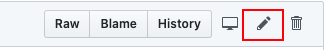

I’ve added links for the images of Oscar and placeholder for Kelly in the file. So all you have to do is create the card sections and card markdown.

**To Do**
File to edit in GitHub for TRIRIGA personas - https://github.ibm.com/ai-applications/design/blob/master/src/pages/personas/tririga/all.mdx
Select the pencil Icon to edit the markdown content - 

For each persona card add the following markdown:
Replace <> + instruction text with your relevant persona text.

```mdx
<PersonaCard
  personaName="<insert persona name>"
  personaPage="<insert persona PDF slides>"
  personaRole="<insert either admin, dev or user>"
  personaStatus="<insert either Draft or Validated>"
  personaImage={<insert card image name stated at the top of the file e.g. cardKelly or cardOscar>}
  personaPrimary <remove this entire line if this is not a primary persona or remove this comment if it is.>
  personaTitle="<insert persona job title>"
  personaTitleDescription="<insert persona short description>"
/>
```
